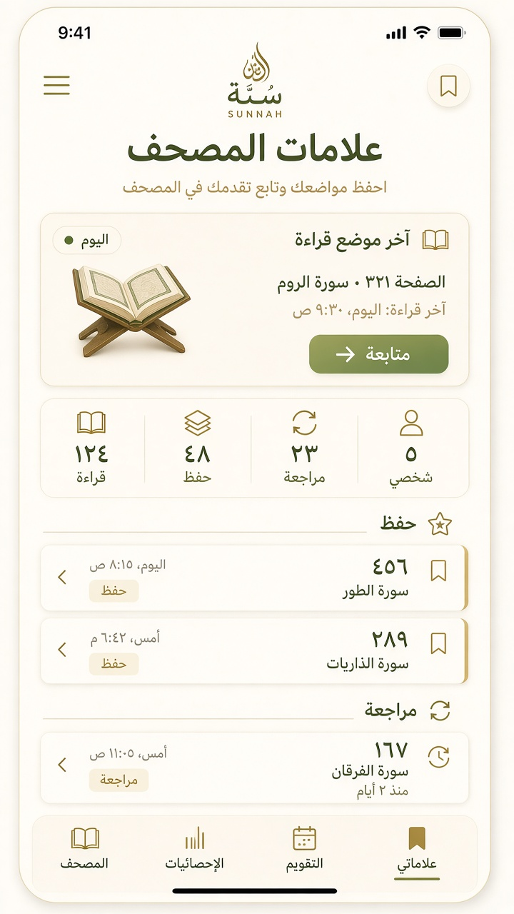

# نظام علامات المصحف V2 — سُنّة (رفيق المصحف)

حالة التنفيذ: **IMPLEMENTED (local-first companion)** · metadata فقط · بلا تعديل نص/ترقيم/تخطيط المصحف.

## 1. Data model

| حقل | معنى |
|---|---|
| `id` | معرّف رقمي محلي |
| `kind` | `reading` \| `hifz` \| `review` \| `custom` \| `khatmah` (+ legacy: wird/tadabbur/lesson) |
| `page` | الموضع الحالي (صفحة المصحف) |
| `ayahKey` | مرجع مستقر `سورة:آية` |
| `khatmaType?` | `general` \| `ramadan` \| `hifz` \| `special` |
| `rangeFromPage?` / `rangeToPage?` | بداية→هدف (حفظ/مراجعة/ختمة) |
| `note?` | ملاحظة اختيارية ≤240 |
| `createdAt` / `updatedAt` | ISO |

**قواعد**

- `reading`: موضع قراءة نشط واحد فقط — كل حفظ يستبدل السابق + `savePagePosition`.
- `hifz`: بداية / الحالي / الهدف عبر النطاق + `page`.
- `review`: نطاق مراجعة `from → to`.
- `khatmah`: تقدم على ٦٠٤ صفحة (`1 → 604`).
- `custom`: علامة شخصية باسم/لون اختياري.
- لا تكرار لنفس `(ayahKey, kind)` النشط (ما عدا reading الذي يُصفّى بالكامل).

## 2. Sync architecture

```
UI (sheet / tabs / manager / resume / search)
        ↓
quran-my-bookmarks-ops   (flows + progress + search)
        ↓
quran-my-bookmarks       (local JSON + mem index)
        ↓
mushaf-bookmark-cloud-sync → reading_resume bundle `mushaf_marks_v1`
mushaf-bookmark-analytics  → streak / pages / khatma %
```

1. Offline-first: كل كتابة محلية فورية.
2. `scheduleMushafBookmarksSync` يعلّم dirty ويؤجّل الدفع.
3. عند اتصال + جلسة: دمج بـ `updatedAt` ثم رفع الحزمة.
4. جدول `bookmarks` العام (دروس/كتب) غير مستخدم لعلامات المصحف.

## 3. Local storage strategy

| مفتاح | دور |
|---|---|
| `myBookmarks` | قائمة العلامات (JSON ذرّي + native-storage) |
| `myBookmarks:ayah-migrated-v1` | علامة ترحيل |
| `myBookmarks:last-used-id` | آخر فتح سريع |
| `myBookmarks:cloud-dirty` | طابور مزامنة |
| `myBookmarks:analytics-v1` | أيام القراءة + أحداث المراجعة |

حد أقصى: `MY_BOOKMARKS_MAX = 1000`. فهرس صفحات في الذاكرة `memPageIndex`.

## 4. Resume-reading flow

1. زر/ضغط طويل → «حفظ آخر موضع قراءة» (نقرة واحدة، بلا تأكيد).
2. يُنشأ/يُستبدل `kind=reading` + تحديث موضع الصفحة.
3. بطاقة «متابعة القراءة» تعرض: الصفحة · السورة · وقت الحفظ · CTA «متابعة».
4. المدير يفتح العلامة فورًا عبر `bookmarkHref` (`/mushaf?page&surah&ayah`).

## 5. Memorization flow

1. «إضافة علامة حفظ» → بداية + هدف + ملاحظة اختيارية («هنا بداية الحفظ»).
2. `page` = الموضع الحالي؛ `rangeFromPage`/`rangeToPage` = البداية/الهدف.
3. المدير يعرض تقدمًا: `ص الحالي → الهدف` + نسبة مئوية.
4. `updateHifzCurrentPage` يحدّث الموضع أثناء التقدّم.

## 6. Revision flow

1. «إضافة علامة مراجعة» → من→إلى + ملاحظة («مراجعة الأسبوع القادم»).
2. العرض: «المراجعة الحالية: ص ٤٨٠ → ص ٥١٠».
3. البحث بكلومات «المراجعة» / «تثبيت» يعيد هذه العلامات.

## 7. Khatmah flow

1. «بدء ختمة» → نوع: عامة / رمضان / حفظ / خاصة.
2. نطاق ثابت `1 → 604`؛ `page` موضع الإكمال الحالي.
3. المدير: `صفحات منجزة/٦٠٤` + نسبة.
4. `updateKhatmahCurrentPage` يحدّث التقدم.

## 8. Bookmark manager

المسار: `/mushaf/bookmarks` — عنوان «علامات المصحف».

مجموعات مرتبة:

1. آخر موضع قراءة  
2. موضع الحفظ  
3. موضع المراجعة  
4. الختمات  
5. العلامات الشخصية  
(+ legacy إن وُجد)

إحصاءات أعلى الصفحة + بحث محلي + تصدير/استيراد JSON.

## 9. Search integration

- `searchMushafBookmarksForQuery` يطابق التسمية/الملاحظة/aliases (مثل «الحفظ»).
- مدمج في `runUniversalSearch` كنتائج قسم القرآن قبل فهرس المحتوى عبر **dynamic import** (لا استيراد ساكن حتى لا يرتفع TBT الرئيسية).
- مدير العلامات يعرض نفس المرشّحات محليًا.

## 10. UI mockups

```
┌─ المصحف ──────────────────┐
│ ▌ ألسنة هامشية (لا تغطي النص) │
│                            │
│  ┌─ ورقة علامة ──────────┐ │
│  │ حفظ آخر موضع قراءة     │ │
│  │ إضافة علامة حفظ        │ │
│  │ إضافة علامة مراجعة     │ │
│  │ إضافة علامة شخصية      │ │
│  │ بدء ختمة               │ │
│  └────────────────────────┘ │
└────────────────────────────┘

┌─ متابعة القراءة ──────────┐
│ الصفحة ٣٢١ · البقرة       │
│ وقت الحفظ: …              │
│              [متابعة]     │
└───────────────────────────┘

┌─ علامات المصحف ───────────┐
│ قراءة · حفظ · مراجعة · ختمات · شخصي │
│ الحفظ: ص ١٢٨ → ١٤٠ (٪)    │
│ المراجعة: ص ٤٨٠ → ٥١٠     │
│ ختمة رمضان: ٢١٠/٦٠٤       │
└───────────────────────────┘
```




## 11. Accessibility review

- RTL كامل؛ أرقام عربية في العروض.
- `role="dialog"` + `aria-label` عربية على الورقة/الملحّن/الألسنة.
- أهداف لمس ≥ ~44px على أزرار الورقة.
- الألسنة `aria-label` بنوع العلامة؛ لا تغطي نص الآية (`pointer-events` فقط على اللسان).
- بلا نوافذ تأكيد إضافية عند الاستئناف أو حفظ موضع القراءة.

## 12. Performance review

- لا استيراد سحابي في مسار قلب الصفحة.
- المزامنة بعد idle/timeout قصير؛ analytics محلية فورية.
- بحث العلامات = مسح محلي صغير (≤1000) قبل فهرس البحث الثقيل.
- مؤشرات الهامش عبر `useLayoutEffect` موضعي — بلا إعادة بناء Geometry.
- مدير العلامات يحمّل CSS منفصل (`reader-bookmarks-manager.css`) خارج حزمة القارئ.

## Before / after

| قبل (V1) | بعد (V2) |
|---|---|
| أربعة أنواع منتج | + ختمات بأنواعها + نطاق مراجعة/حفظ |
| استئناف بلا وقت حفظ | بطاقة متابعة + وقت الحفظ |
| بلا بحث موحّد للعلامات | aliases + دمج في البحث الرئيسي |
| analytics بسيطة | streak · صفحات · تقدم ختمة |
| مدير بلا مجموعات ختمة | مجموعات كاملة مرتبة |

## حماية المصحف

العلامات metadata فقط. ممنوع تعديل: نص القرآن · تخطيط الصفحة · الترقيم · رسم الآيات.
